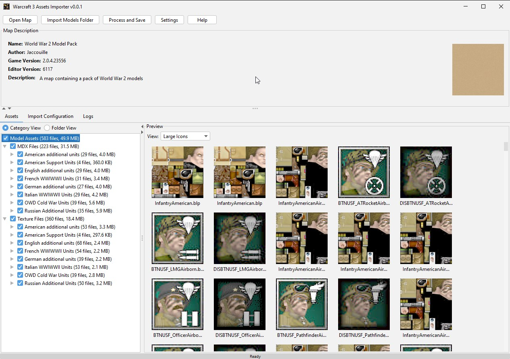
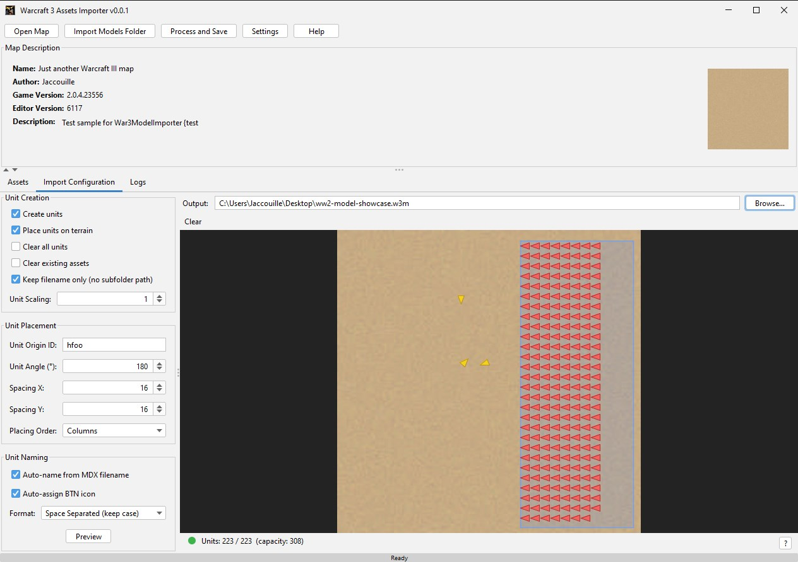

# War3AssetsImporter

A desktop tool for batch import custom 3D models (MDX) and textures into Warcraft 3 map files (`.w3x` / `.w3m`).

Built with Java Swing. Work in progress.

---

## Features

- Browse and select MDX and textures assets from a folder tree
- Preview textures before importing
- Automatically generates unit definitions and places them on the map
- Draws a placement preview so you can see where units will appear
- Supports English and French UI

## Screenshots

### Assets Panel



### Import Configuration Panel



## Download

Grab the latest `War3AssetsImporter.jar` from the [Releases](../../releases) page.

## Running

```bash
java -jar War3AssetsImporter.jar
```

No installation needed.

## Usage

1. Click **Open Map** and select a `.w3x` or `.w3m` file
2. Click **Open Assets Folder** and point to your MDX/BLP directory
3. Check the assets you want to import in the tree panel
4. Configure unit naming and placement options in the **Import Configuration** tab
5. Click **Process & Save** - the tool writes a new file named `processed_<mapname>.w3x`

## Building from Source

Requires JDK 17+ (the project uses a Java 17 toolchain).  
The Gradle wrapper is included, so no global Gradle installation is required.

```bash
# Clone the repo
git clone https://github.com/YOUR_USERNAME/War3AssetsImporter.git
cd War3AssetsImporter

# Build
./gradlew clean build

# Or run directly
./gradlew run

# Build the standalone JAR used in releases
./gradlew shadowJar
# Output: build/libs/War3AssetsImporter.jar
```

On Windows use `gradlew.bat` instead of `./gradlew`.

## Deploying a New Version

This repository has a release workflow in `.github/workflows/release.yml` that runs when a tag like `v1.2.3` is pushed.

### Quick Release Checklist

| Step | Command / Action |
| --- | --- |
| 1. Bump version | Update `version 'x.y.z'` in `build.gradle` |
| 2. Commit + push | `git add build.gradle README.md && git commit -m "Release vX.Y.Z" && git push` |
| 3. Tag + push | `git tag vX.Y.Z && git push origin vX.Y.Z` |
| 4. Verify workflow | Check GitHub Actions `Release` workflow status |
| 5. Verify assets | Confirm release contains Windows/macOS/Linux zip files |

1. Update the version in `build.gradle`:
```groovy
version 'x.y.z'
```
2. Commit and push your changes:
```bash
git add build.gradle README.md
git commit -m "Release vX.Y.Z"
git push
```
3. Create and push the release tag:
```bash
git tag vX.Y.Z
git push origin vX.Y.Z
```
4. Wait for the GitHub Actions `Release` workflow to finish.
5. Verify the GitHub Release was created with the attached platform zip files:
- `War3AssetsImporter-windows.zip`
- `War3AssetsImporter-macos.zip`
- `War3AssetsImporter-linux.zip`

## License

[MIT](LICENSE)
